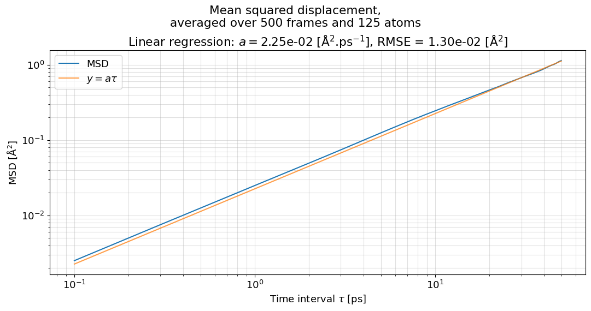
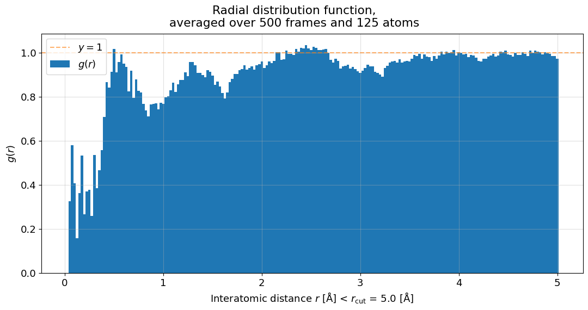
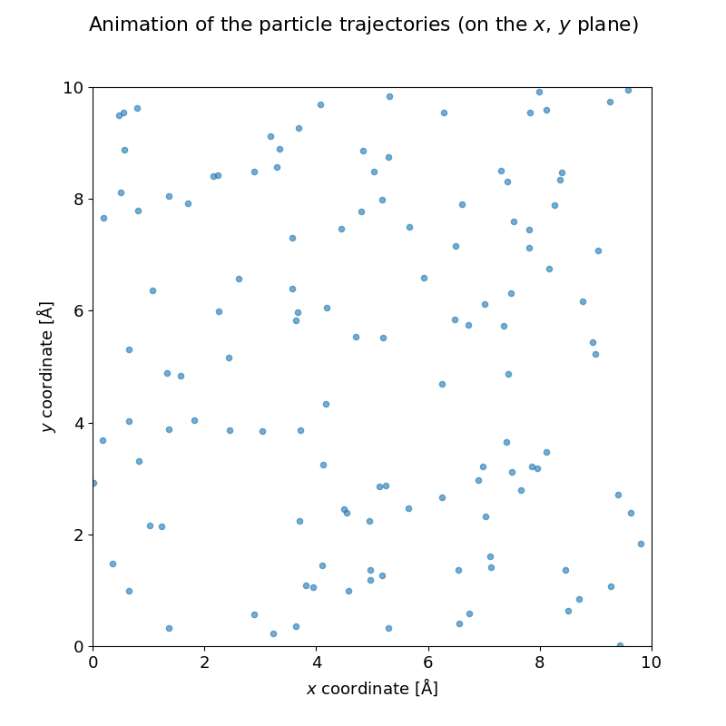

========
Examples
========

This section provides a step-by-step tutorial on how to use this code.
We will go through the main features of the code, for more details please refer to the documentation.

Imports
-------

Let's first import the only module we need.
Notice we don't need :doc:`fastmsd` or :doc:`fastrdf` since the class :class:`trajectory.Trajectory` will be using these modules in our stead.

.. code-block:: python
	
	from trajectory import Trajectory

Loading the trajectory
----------------------

Let's now load a trajectory, providing we have one at hand. Here, we'll use the one given for the assignment.

.. code-block:: python

    traj = Trajectory("../res/tristan_md_trajectory_N125_F500_L10.0.xyz")
    traj

The last line of the code above prints information regarding the trajectory like the number of atoms and the number of frames.

Mean Squared Displacement
-------------------------

Let's compute the **MSD** for the trajectory:

.. code-block:: python

    msd = traj.mean_squared_displacement()

Radial Distribution Function
----------------------------

Let's compute the **RDF** of the trajectory:

.. code-block:: python

    rdf = traj.radial_distribution_function()

Animation
---------

Finally, let us animate the trajectories of the particles, projected on the xy-plane:

.. code-block:: python

    anim = traj.animate()
    anim.save('../res/trajectory.gif', writer='pillow', fps=30)

The last line of the code above allows to save the file as a gif.

